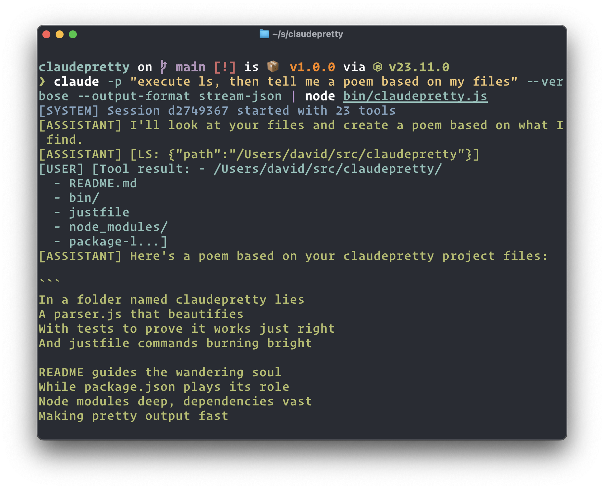
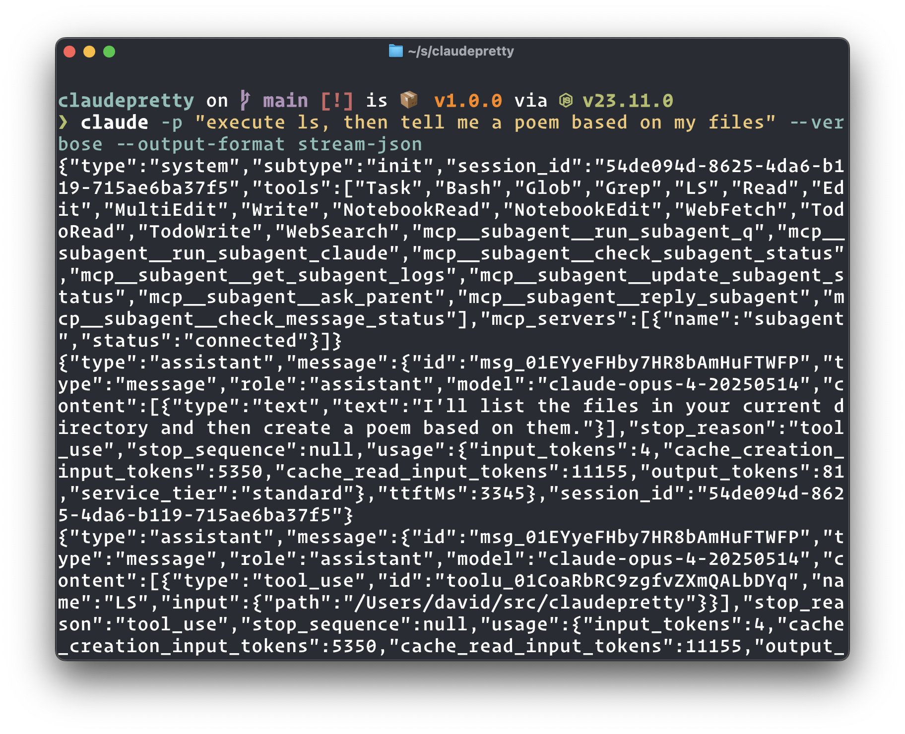

# claudepretty

A CLI tool for pretty-printing streamed JSON output from Claude's `--output-format stream-json --verbose` non-interactive mode.

[](https://opensource.org/licenses/MIT)
[](https://nodejs.org/)

Generates this:



From this:



## Installation

```bash
npm install -g claudepretty
```

## Usage

Use with Claude's streaming JSON output:

```bash
claude -p "create a simple todo app" --verbose --output-format stream-json | claudepretty
```

## Requirements

- Node.js 18.0.0+
- Used exclusively with piped input

## License

MIT © [David Mohl](https://github.com/dvcrn)
